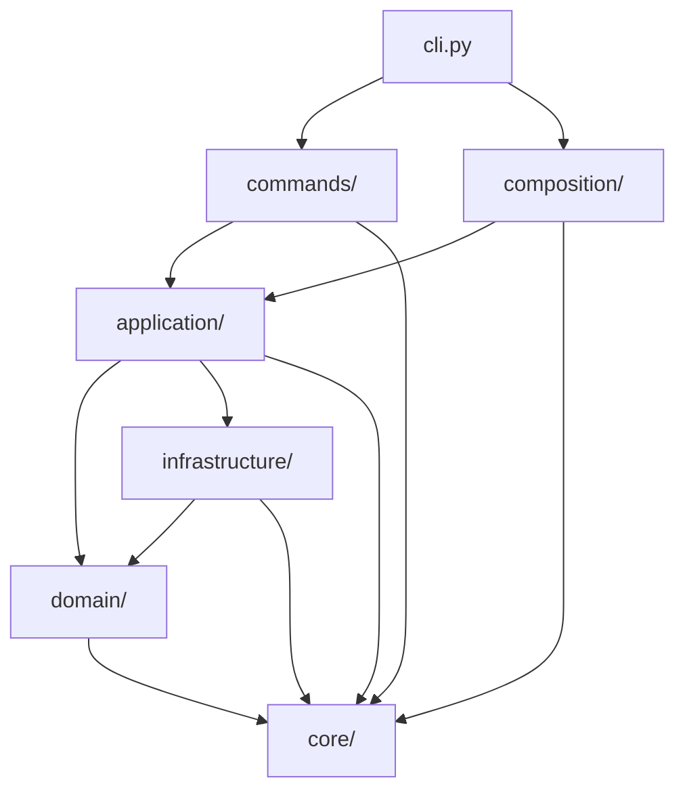
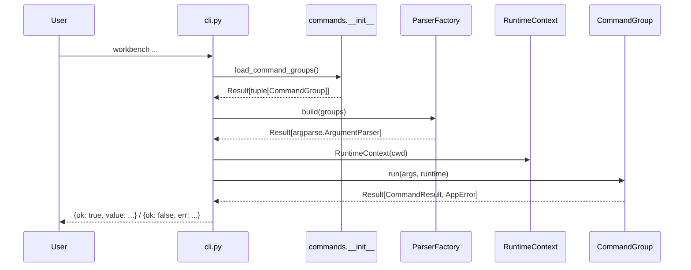
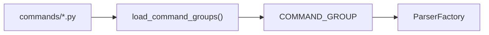
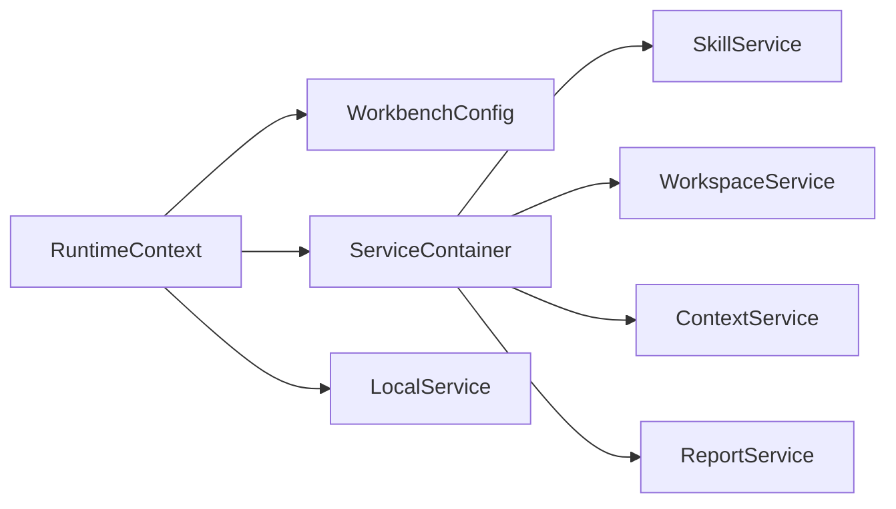
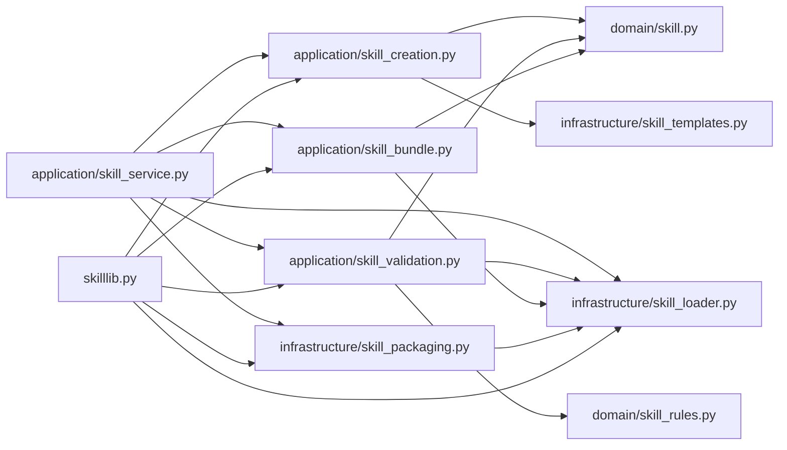

# Workbench 架构说明

这份文档描述的是当前仓库里的实际结构，不是未来目标图。

它解决两个问题：

- 新维护者怎样快速看懂现在的实现
- 接下来还要继续演进的地方具体在哪里

## 1. 一眼看懂

`workbench` 当前是一个分层 CLI，应按下面这个顺序理解：

- `cli.py`
  - 进程入口、统一 JSON 输出、命令分发
- `composition/`
  - 运行时装配
- `commands/`
  - CLI 协议、命令声明、参数注册
- `application/`
  - 用例编排
- `domain/`
  - 领域对象、规则、错误语义
- `infrastructure/`
  - 文件、git、子进程、注册表等外部交互
- `core/`
  - `Result` / `Option`



主规则很简单：外层依赖内层，内层不反向依赖外层。

## 2. 目录职责

### `core/`

这里只放跨全项目的基础协议：

- `Result[T, E]`
- `Option[T]`

这层不应该知道 CLI、workspace、skill 这些业务概念。

### `domain/`

这里放业务语义本身，而不是参数解析或 IO 细节。

当前主要有：

- `errors.py`
  - `AppErrorCode`
  - `AppError`
- `workspace.py`
  - `Workspace`
  - remote URL 规则
  - check command 规则
- `skill.py`
  - `Skill`
  - skill 共享常量
- `skill_rules.py`
  - skill lint 规则

这层的约束：

- 不依赖 `argparse`
- 不直接起子进程
- 不直接操作持久化文件

### `infrastructure/`

这里负责与外部世界交互：

- `git_client.py`
- `process_runner.py`
- `workspace_registry.py`
- `skill_loader.py`
- `skill_templates.py`
- `skill_packaging.py`

这层可以做 IO，但不负责业务流程编排。

### `application/`

这里是用例层，负责把 domain 规则和 infrastructure 适配器拼起来。

当前主要 service：

- `WorkspaceService`
- `SkillService`
- `ContextService`
- `ReportService`
- `LocalService`

skill 相关 use case 已经拆成独立函数模块：

- `skill_creation.py`
- `skill_validation.py`
- `skill_bundle.py`

### `composition/`

这里是运行时 composition root。

- `runtime.py`
  - `RuntimeContext`
  - `ServiceContainer`
  - `build_service_container`

它负责：

- 加载 `WorkbenchConfig`
- 保证基础目录存在
- 延迟创建 service graph
- 为 `local` 命令单独缓存 `LocalService`

### `commands/`

这里是命令层，不是业务层。

关键抽象：

- `CommandSpec`
- `ArgumentSpec`
- `CommandGroup`
- `CommandResult`
- `ParserFactory`

每个 `*_command.py` 文件只做两件事：

1. 声明命令结构
2. 把解析后的参数交给对应 application service

### 根级模块

根目录仍然有一批重要模块，它们分成两类：

兼容包装层：

- `skilllib.py`
- `context.py`
- `workspace.py`

根级功能模块：

- `localops.py`
- `config.py`
- `bootstrap.py`
- `report.py`
- `fs.py`

其中兼容包装层已经不是主逻辑承载点，`localops.py` 仍然是较大的函数式模块。

## 3. 启动链路

CLI 启动过程在 [cli.py](/C:/Users/nyml/code/work-context/src/workbench/cli.py) 很薄：

1. 调用 `load_command_groups()`
2. 用 `ParserFactory` 构建 parser
3. 创建 `RuntimeContext`
4. 根据 `args.command` 找到对应 `CommandGroup`
5. 统一输出 JSON



这里最大的变化是：

- `cli.py` 不再手工构造每个 subparser
- `RuntimeContext` 已经从 `commands/base.py` 抽到了 `composition/runtime.py`

## 4. 命令是怎么被加载的

`commands/__init__.py` 采用自动发现机制：

- 扫描 `commands/` 下模块
- 跳过 `base.py`
- 导入模块
- 收集模块导出的 `COMMAND_GROUP`
- 按 `(order, name)` 排序

也就是说，新增一级命令的标准做法是：

1. 新建一个 `*_command.py`
2. 暴露 `COMMAND_GROUP`
3. 让自动加载器发现它

而不是再去改 `cli.py`。



## 5. `commands/base.py` 现在负责什么

[commands/base.py](/C:/Users/nyml/code/work-context/src/workbench/commands/base.py) 当前只负责 CLI 协议：

- `ArgumentSpec`
- `CommandSpec`
- `CommandGroup`
- `CommandResult`
- `ParserFactory`

它不再负责 service graph 装配。

`ParserFactory` 还会在 parser 构建阶段做冲突检查：

- 一级命令重名
- 子命令重名
- option flag 冲突
- positional 参数冲突
- `dest` 冲突
- 忘记声明 `subcommand_dest`

## 6. RuntimeContext 与 ServiceContainer

运行时装配集中在 [runtime.py](/C:/Users/nyml/code/work-context/src/workbench/composition/runtime.py)。



`ServiceContainer` 当前只收纳：

- `config`
- `skill`
- `workspace`
- `context`
- `report`

`LocalService` 单独缓存，不放进 `ServiceContainer`，因为它只依赖 repo root，不需要完整 config 装配。

## 7. skill 模块现在怎么拆

skill 已经不再由一个胖 `skilllib.py` 承担主逻辑。



分层职责如下：

- `domain/skill.py`
  - `Skill`
  - skill 共享常量
  - `skill_to_record`
- `domain/skill_rules.py`
  - lint 规则收集
- `infrastructure/skill_loader.py`
  - 发现 skill
  - 解析 `SKILL.md`
  - 读取 `agents/openai.yaml`
- `infrastructure/skill_templates.py`
  - 读取 scaffold 模板
- `infrastructure/skill_packaging.py`
  - zip 打包
  - sync 安装
- `application/skill_creation.py`
  - 创建 skill
- `application/skill_validation.py`
  - lint
- `application/skill_bundle.py`
  - bundle 渲染
  - fixture 执行

[skilllib.py](/C:/Users/nyml/code/work-context/src/workbench/skilllib.py) 现在只是兼容导出层。

## 8. Context / Report / Local 三条链

### Context

[context_service.py](/C:/Users/nyml/code/work-context/src/workbench/application/context_service.py) 会编排：

- `SkillService.find_skill`
- `SkillService.render_bundle`
- 可选的 `WorkspaceService.get_workspace`

它既能返回 payload，也能写出 `.json` / `.md` 文件。

### Report

[report_service.py](/C:/Users/nyml/code/work-context/src/workbench/application/report_service.py) 当前是轻量编排器：

- 先跑 skill lint
- 再读 workspace 列表
- 最后写 Markdown report

### Local

`local` 这条链目前是：

- [local_command.py](/C:/Users/nyml/code/work-context/src/workbench/commands/local_command.py)
- [local_service.py](/C:/Users/nyml/code/work-context/src/workbench/application/local_service.py)
- [localops.py](/C:/Users/nyml/code/work-context/src/workbench/localops.py)

`LocalService` 很薄，主要是把参数转交给 `localops.py`。

`localops.py` 当前承担：

- boundary 检查
- 文件读写
- grep
- list
- mkdir
- stat

所以它仍然是当前最明显的根级“大模块”。

## 9. 统一返回协议

项目公开边界统一走 `Result` / `Option`：

- 成功：`Result.ok(value)`
- 失败：`Result.err(AppError(...))`
- 缺失但不是错误：`Option.none()`

CLI 输出协议固定为：

```json
{"ok": true, "value": {...}}
```

```json
{"ok": false, "err": {"code": "...", "message": "...", "context": {...}}}
```

这样 parser、业务流程、IO 失败都能用同一套结构回传。

## 10. 当前保留下来的兼容面

虽然主逻辑已经迁到分层目录，但还有三条兼容面保留在根级：

- [skilllib.py](/C:/Users/nyml/code/work-context/src/workbench/skilllib.py)
- [context.py](/C:/Users/nyml/code/work-context/src/workbench/context.py)
- [workspace.py](/C:/Users/nyml/code/work-context/src/workbench/workspace.py)

它们的作用是：

- 稳住旧调用点
- 避免一次性迁移所有 import

这类模块应该被视为 compatibility façade，而不是新的核心模块。

## 11. 当前技术债

下面这些是现在真实存在的技术债。

### `localops.py` 仍然过大

它已经统一走 `Result`，但职责仍然集中在一个根级函数集合里。

### 根级兼容层还没完全收口

`skilllib.py`、`context.py`、`workspace.py` 仍然存在，说明旧调用面尚未完全迁移。

### service 有些地方仍然偏“包装器”

以 `SkillService` 为例，它当前主要在串接多个纯函数 use case。

这不是错误，但后续需要继续判断：

- 它是否应该继续作为稳定应用边界
- 还是再收敛出更明确的 façade / module boundary

## 12. 建议下一步

按当前结构，下一阶段最合理的顺序是：

1. 拆 `localops.py`
2. 收缩根级兼容层的调用面
3. 继续把 root 下遗留功能模块内聚到 `domain/application/infrastructure`

当前不建议做的事：

- 再把命令注册逻辑塞回 `cli.py`
- 为了“纯函数化”而引入过度抽象
- 在没有收益的情况下把模块拆得过碎

## 13. 阅读顺序

第一次接手这个仓库，建议这样看：

1. [cli.py](/C:/Users/nyml/code/work-context/src/workbench/cli.py)
2. [runtime.py](/C:/Users/nyml/code/work-context/src/workbench/composition/runtime.py)
3. [base.py](/C:/Users/nyml/code/work-context/src/workbench/commands/base.py)
4. [__init__.py](/C:/Users/nyml/code/work-context/src/workbench/commands/__init__.py)
5. [workspace_service.py](/C:/Users/nyml/code/work-context/src/workbench/application/workspace_service.py)
6. [skill_service.py](/C:/Users/nyml/code/work-context/src/workbench/application/skill_service.py)
7. [workspace.py](/C:/Users/nyml/code/work-context/src/workbench/domain/workspace.py)
8. [skill.py](/C:/Users/nyml/code/work-context/src/workbench/domain/skill.py)
9. [result.py](/C:/Users/nyml/code/work-context/src/workbench/core/result.py)
