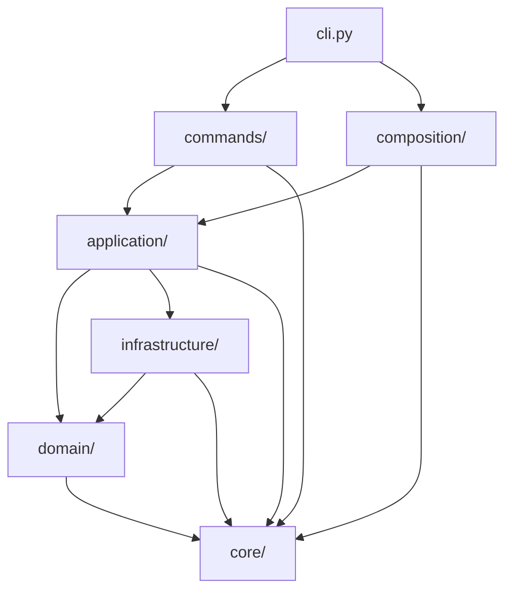
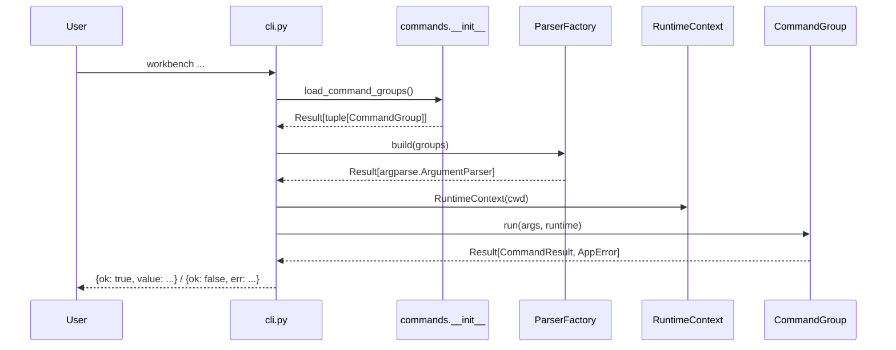
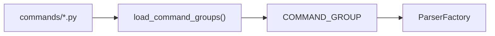
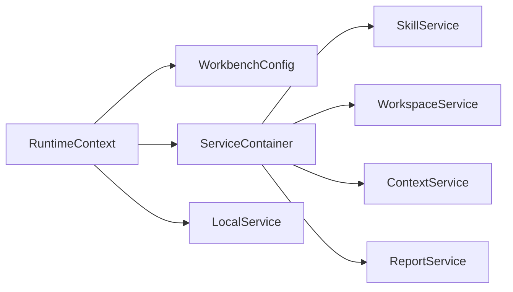
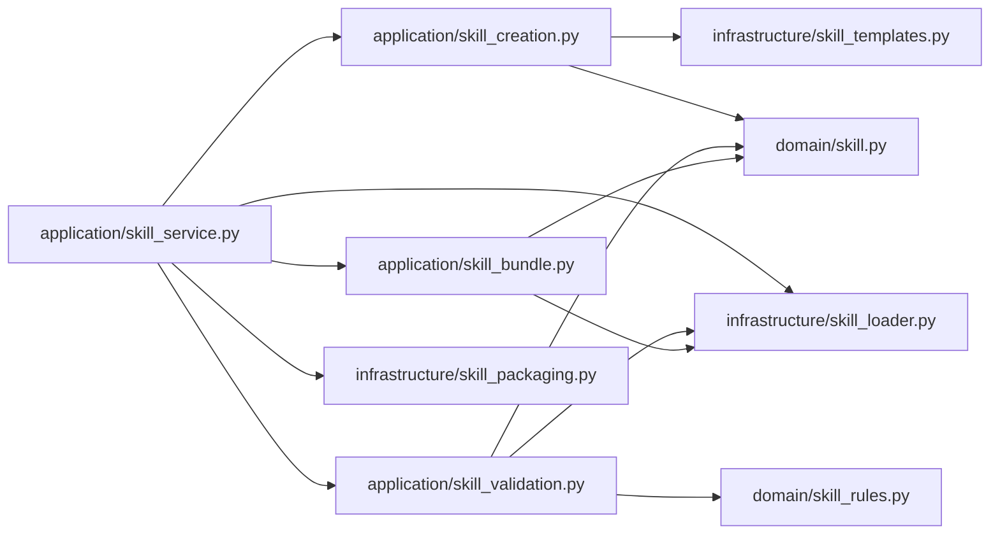

# Workbench 架构说明

这份文档描述的是当前仓库里的实际结构，不是历史状态，也不是未来愿景图。

它主要回答 4 个问题：

- 新维护者应该先看哪里
- CLI 到业务逻辑的调用链怎么走
- 模块分层边界是什么
- 接下来还应该往哪里继续收口

## 1. 一眼看懂

`workbench` 当前是一个分层 CLI，推荐按下面的顺序建立心智模型：

- `cli.py`
  - 进程入口、统一 JSON 输出、命令分发
- `composition/`
  - 运行时装配
- `commands/`
  - 命令声明、参数协议、parser 构建
- `application/`
  - 用例编排
- `domain/`
  - 领域对象、规则、错误语义
- `infrastructure/`
  - 文件、git、子进程、注册表等外部交互
- `core/`
  - `Result` / `Option`



主规则很简单：

- 外层依赖内层
- 业务规则不反向依赖 CLI
- IO 细节不直接泄漏到命令层
- 公开边界统一走 `Result` / `Option`

## 2. 分层职责

### `core/`

这里只放跨全项目的基础协议：

- `Result[T, E]`
- `Option[T]`

这层不应该知道 skill、workspace、CLI 这些业务概念。

### `domain/`

这里放业务语义本身，而不是参数解析或 IO 细节。

当前主要有：

- `errors.py`
  - `AppErrorCode`
  - `AppError`
- `workspace.py`
  - `Workspace`
  - remote URL 规则
  - check command 规则
- `skill.py`
  - `Skill`
  - skill 共享常量
- `skill_rules.py`
  - skill lint 规则

这层的约束：

- 不依赖 `argparse`
- 不直接起子进程
- 不直接操作持久化文件

### `infrastructure/`

这里负责与外部世界交互：

- `git_client.py`
- `process_runner.py`
- `workspace_registry.py`
- `local_files.py`
- `report_output.py`
- `skill_loader.py`
- `skill_templates.py`
- `skill_packaging.py`

这层可以做 IO，但不负责跨多个对象的业务流程编排。

### `application/`

这里是用例层，负责把 domain 规则和 infrastructure 适配器拼起来。

当前主要 service：

- `SkillService`
- `WorkspaceService`
- `ContextService`
- `LocalService`
- `ReportService`

skill 相关 use case 已经拆成纯函数模块：

- `skill_creation.py`
- `skill_validation.py`
- `skill_bundle.py`

这层的定位是：

- 给命令层提供稳定入口
- 不把命令行参数对象泄漏进来
- 不把底层文件布局细节扩散出去

### `composition/`

这里是运行时 composition root。

- `runtime.py`
  - `RuntimeContext`
  - `ServiceContainer`
  - `build_service_container`

它负责：

- 加载 `WorkbenchConfig`
- 保证基础目录存在
- 延迟装配 service graph
- 为 `local` 命令单独缓存 `LocalService`

### `commands/`

这里是命令层，不是业务层。

关键抽象：

- `ArgumentSpec`
- `CommandSpec`
- `CommandGroup`
- `CommandResult`
- `ParserFactory`

每个 `*_command.py` 文件只做两件事：

1. 声明命令结构
2. 把解析后的参数转交给 application service

## 3. 启动链路

CLI 启动过程在 [cli.py](/C:/Users/nyml/code/work-context/src/workbench/cli.py) 很薄：

1. 调用 `load_command_groups()`
2. 用 `ParserFactory` 构建 parser
3. 创建 `RuntimeContext`
4. 根据 `args.command` 找到对应 `CommandGroup`
5. 统一输出 JSON



这个链路的关键点是：

- `cli.py` 不再手工堆一大串 subparser
- parser 冲突在构建阶段提前失败
- 业务错误和参数错误都能走统一错误协议回传

## 4. 命令是怎么接入的

[commands/__init__.py](/C:/Users/nyml/code/work-context/src/workbench/commands/__init__.py) 负责装载命令组。

当前机制是命令包内约定式发现：

- 扫描 `commands/` 下模块
- 跳过 `base.py`
- 导入模块
- 收集模块导出的 `COMMAND_GROUP`
- 按 `(order, name)` 排序

也就是说，新增一级命令的标准做法是：

1. 新建一个 `*_command.py`
2. 暴露 `COMMAND_GROUP`
3. 让装载器发现它

而不是继续去改 `cli.py`。



## 5. `commands/base.py` 负责什么

[commands/base.py](/C:/Users/nyml/code/work-context/src/workbench/commands/base.py) 当前只负责 CLI 协议：

- 命令声明模型
- 参数声明模型
- parser 构建
- 冲突校验

`ParserFactory` 会在 parser 构建阶段校验：

- 一级命令重名
- 子命令重名
- option flag 冲突
- positional 参数冲突
- `dest` 冲突
- 缺失 `subcommand_dest`

这一步很重要，因为它把很多原本只能在运行时才撞出来的问题前置到了启动期。

## 6. RuntimeContext 与 ServiceContainer

运行时装配集中在 [runtime.py](/C:/Users/nyml/code/work-context/src/workbench/composition/runtime.py)。



`ServiceContainer` 当前收纳：

- `config`
- `skill`
- `workspace`
- `context`
- `report`

`LocalService` 单独缓存，不放进 `ServiceContainer`，原因是：

- 它只依赖 repo root
- 不需要完整 config 装配
- 可以让 `local` 命令在没有 `workbench.toml` 的目录下也工作

## 7. 主要业务链路

### Skill 链路



职责分布如下：

- `SkillService`
  - application façade
  - 对命令层暴露稳定接口
- `skill_creation.py`
  - 创建 skill 脚手架
- `skill_validation.py`
  - lint
- `skill_bundle.py`
  - bundle 渲染
  - fixture 执行
- `skill_loader.py`
  - 发现 skill
  - 解析 `SKILL.md`
  - 读取 `agents/openai.yaml`
- `skill_packaging.py`
  - 打包与同步

### Workspace 链路

[workspace_service.py](/C:/Users/nyml/code/work-context/src/workbench/application/workspace_service.py) 负责编排：

- workspace 注册
- safe check 执行
- git remote 状态比对
- remote 初始化 / 修复

它依赖的主要基础设施是：

- [workspace_registry.py](/C:/Users/nyml/code/work-context/src/workbench/infrastructure/workspace_registry.py)
- [git_client.py](/C:/Users/nyml/code/work-context/src/workbench/infrastructure/git_client.py)
- [process_runner.py](/C:/Users/nyml/code/work-context/src/workbench/infrastructure/process_runner.py)

### Context 链路

[context_service.py](/C:/Users/nyml/code/work-context/src/workbench/application/context_service.py) 会编排：

- `SkillService.find_skill`
- `SkillService.render_bundle`
- 可选的 `WorkspaceService.get_workspace`

它既能返回 payload，也能直接写出 `.json` / `.md` 文件。

### Local 链路

`local` 这条链当前是：

- [local_command.py](/C:/Users/nyml/code/work-context/src/workbench/commands/local_command.py)
- [local_service.py](/C:/Users/nyml/code/work-context/src/workbench/application/local_service.py)
- [local_files.py](/C:/Users/nyml/code/work-context/src/workbench/infrastructure/local_files.py)

`LocalService` 很薄，主要作用是把命令层调用转成稳定应用接口。

`local_files.py` 当前承担：

- boundary 检查
- 文件读写
- grep
- list
- mkdir
- stat

### Report 链路

[report_service.py](/C:/Users/nyml/code/work-context/src/workbench/application/report_service.py) 当前是轻量编排器：

- 先跑 skill lint
- 再读 workspace 列表
- 最后调用 [report_output.py](/C:/Users/nyml/code/work-context/src/workbench/infrastructure/report_output.py) 写 Markdown report

## 8. 根级模块的现状

当前根目录已经不再保留兼容 façade。

也就是说，下面这些旧入口已经删除：

- `skilllib.py`
- `context.py`
- `workspace.py`
- `localops.py`
- `report.py`

现在如果要引用实现，应直接从分层目录进入：

- skill 走 `application/`、`domain/`、`infrastructure/`
- workspace 走 `application/` 或 `domain/`
- local/report 直接走对应的 `application/` / `infrastructure/`

根级当前保留的主要模块是：

- [cli.py](/C:/Users/nyml/code/work-context/src/workbench/cli.py)
- [bootstrap.py](/C:/Users/nyml/code/work-context/src/workbench/bootstrap.py)
- [config.py](/C:/Users/nyml/code/work-context/src/workbench/config.py)
- [fs.py](/C:/Users/nyml/code/work-context/src/workbench/fs.py)
- [simple_toml.py](/C:/Users/nyml/code/work-context/src/workbench/simple_toml.py)
- [yamlish.py](/C:/Users/nyml/code/work-context/src/workbench/yamlish.py)

这些文件大致分成两类：

- 入口与装配胶水
- 还未完全下沉的基础支撑代码

## 9. 统一返回协议

项目公开边界统一走 `Result` / `Option`：

- 成功：`Result.ok(value)`
- 失败：`Result.err(AppError(...))`
- 缺失但不是错误：`Option.none()`

CLI 输出协议固定为：

```json
{"ok": true, "value": {...}}
```

```json
{"ok": false, "err": {"code": "...", "message": "...", "context": {...}}}
```

这样命令层、业务流程和基础设施失败都能用同一套结构回传。

## 10. 当前技术债

下面这些是现在仍然真实存在的技术债。

### `local_files.py` 仍然偏大

虽然已经迁到 infrastructure，但 boundary 校验、读写、grep、list、stat 仍集中在一个模块里。

### 根级基础模块仍有继续收口空间

`config.py`、`bootstrap.py`、`fs.py`、`simple_toml.py`、`yamlish.py` 里仍有部分代码可以继续按职责下沉：

- 更偏业务规则的逻辑可下沉到 `domain/`
- 更偏用例编排的逻辑可下沉到 `application/`
- 更偏文件格式 / IO 的逻辑可下沉到 `infrastructure/`

### 某些 service 仍偏 façade

以 `SkillService`、`LocalService` 为例，它们现在承担的是稳定应用边界，但内部仍有不少直接转调。

这不是错误，但后续仍要持续判断：

- 哪些 façade 值得保留
- 哪些能力应该继续细化成显式 use case 函数

## 11. 建议下一步

按当前结构，下一阶段最合理的顺序是：

1. 继续拆 `local_files.py`
2. 把根级剩余功能模块继续内聚到 `domain/application/infrastructure`
3. 视收益再决定是否进一步细分 façade service 与 use case 函数边界

当前不建议做的事：

- 再把命令注册逻辑塞回 `cli.py`
- 为了“纯函数化”而引入过度抽象
- 在没有明确收益时把模块拆得过碎

## 12. 阅读顺序

第一次接手这个仓库，建议这样看：

1. [cli.py](/C:/Users/nyml/code/work-context/src/workbench/cli.py)
2. [runtime.py](/C:/Users/nyml/code/work-context/src/workbench/composition/runtime.py)
3. [base.py](/C:/Users/nyml/code/work-context/src/workbench/commands/base.py)
4. [__init__.py](/C:/Users/nyml/code/work-context/src/workbench/commands/__init__.py)
5. [workspace_service.py](/C:/Users/nyml/code/work-context/src/workbench/application/workspace_service.py)
6. [skill_service.py](/C:/Users/nyml/code/work-context/src/workbench/application/skill_service.py)
7. [workspace.py](/C:/Users/nyml/code/work-context/src/workbench/domain/workspace.py)
8. [skill.py](/C:/Users/nyml/code/work-context/src/workbench/domain/skill.py)
9. [result.py](/C:/Users/nyml/code/work-context/src/workbench/core/result.py)
