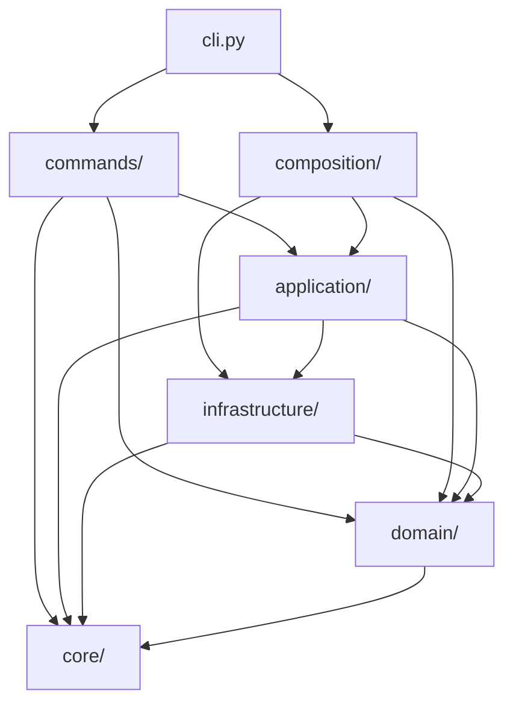
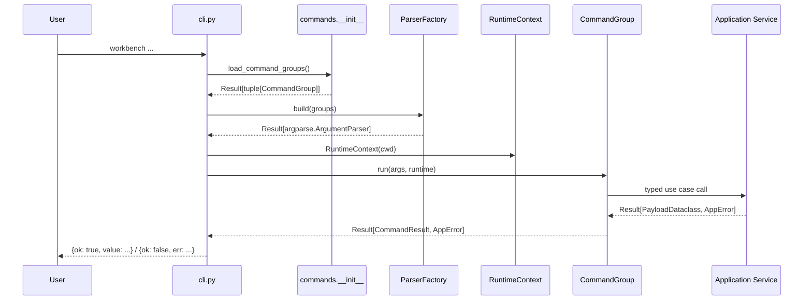
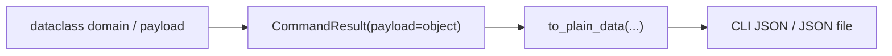
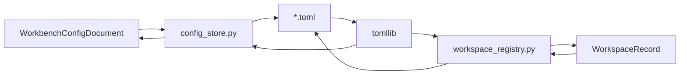
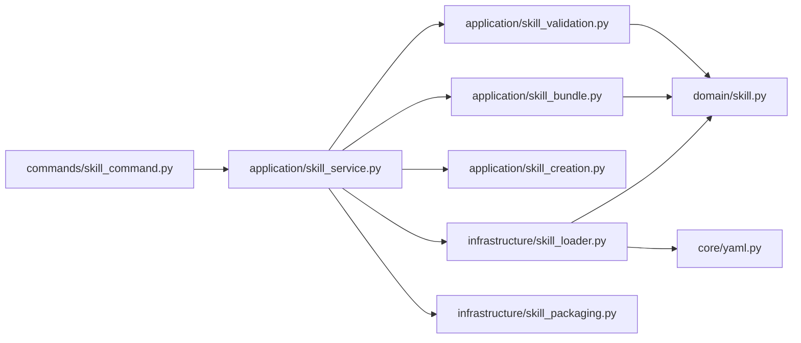
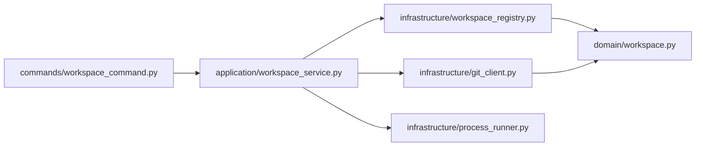
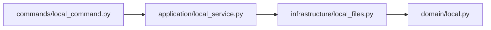
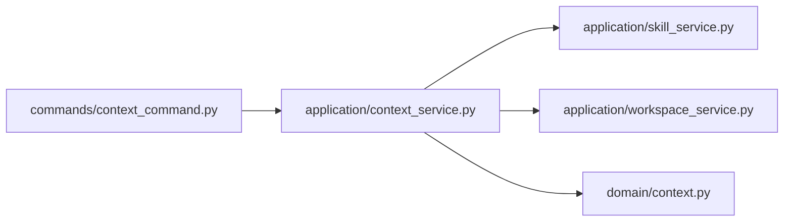
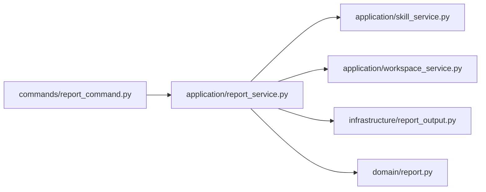

# Workbench 架构说明

这份文档描述的是当前仓库在 `2026-03-21` 的实际结构。

重点回答 5 个问题：

- CLI 到业务逻辑的调用链怎么走
- 现在的分层边界是什么
- dataclass 强类型模型和 JSON/TOML/YAML 边界怎么处理
- skill / workspace / local / context / report 这几条主链路各自落在哪里
- 当前剩余技术债是什么

## 1. 总览

`workbench` 现在是一个分层 CLI，主结构如下：

- `cli.py`
  - 进程入口
  - 统一 JSON 输出
  - 命令分发
- `composition/`
  - runtime composition root
- `commands/`
  - 命令声明
  - parser 构建
  - 命令层适配
- `application/`
  - 用例编排
- `domain/`
  - 领域对象
  - 强类型 payload
  - 错误与配置语义
- `infrastructure/`
  - 文件系统
  - git / subprocess
  - TOML 持久化
  - skill 加载 / 打包
- `core/`
  - `Result` / `Option`
  - 统一序列化
  - 轻量 YAML

核心规则：

- 外层依赖内层
- CLI 不承载业务规则
- application 负责编排，不直接暴露 `argparse`
- domain 用 dataclass 表达业务结构和返回模型
- 对外 JSON 统一在边界序列化，不让业务模型为了 JSON 反向污染自身

## 2. 当前目录职责

### `core/`

这里只保留全项目共享、且不含业务语义的基础协议：

- [result.py](../src/workbench/core/result.py)
  - `Result[T, E]`
  - `Option[T]`
- [serialization.py](../src/workbench/core/serialization.py)
  - `to_plain_data(...)`
  - dataclass / `Path` / `Enum` 到普通数据的统一转换
- [yaml.py](../src/workbench/core/yaml.py)
  - 当前仓库需要的受限 YAML 子集

注意：

- `core/toml.py` 已移除
- TOML 读取现在直接用标准库 `tomllib`
- TOML 写入不做“通用 Any 序列化”，而是由具体持久化模块按显式 schema 输出

### `domain/`

这层承载业务语义和稳定返回模型。

当前主要模块：

- [config.py](../src/workbench/domain/config.py)
  - `WorkbenchConfigDocument`
  - `WorkbenchConfig`
  - 各配置 section dataclass
- [errors.py](../src/workbench/domain/errors.py)
  - `AppErrorCode`
  - `AppError`
  - `AppErrorDetail`
- [skill.py](../src/workbench/domain/skill.py)
  - `Skill`
  - `SkillFrontmatter`
  - `SkillAgentsConfig`
  - `SkillLintPayload`
  - `SkillTestPayload`
- [workspace.py](../src/workbench/domain/workspace.py)
  - `Workspace`
  - `WorkspaceRecord`
  - `WorkspaceCheckPayload`
  - `WorkspaceRemoteInitPayload`
- [local.py](../src/workbench/domain/local.py)
  - `LocalReadPayload`
  - `LocalListPayload`
  - `LocalGrepPayload`
  - `LocalWritePayload`
- [context.py](../src/workbench/domain/context.py)
  - `ContextPayload`
  - `ContextBuildResult`
- [report.py](../src/workbench/domain/report.py)
  - `RepositoryReportPayload`

当前明确约束：

- domain 不依赖 `argparse`
- domain 不起子进程
- domain 不直接做 IO
- domain 对外结构优先使用 dataclass，而不是 `dict[str, Any]`

### `infrastructure/`

这层负责外部交互与持久化：

- [config_store.py](../src/workbench/infrastructure/config_store.py)
  - `workbench.toml` 读取
  - 显式 schema 校验
  - 默认配置写入
- [workspace_registry.py](../src/workbench/infrastructure/workspace_registry.py)
  - workspace 注册表读取 / 写入
- [filesystem.py](../src/workbench/infrastructure/filesystem.py)
  - 文本 / JSON 文件辅助
- [local_files.py](../src/workbench/infrastructure/local_files.py)
  - cwd 边界内的文件操作
- [skill_loader.py](../src/workbench/infrastructure/skill_loader.py)
  - `SKILL.md` front matter 解析
  - `agents/openai.yaml` 解析
  - skill 发现
- [skill_packaging.py](../src/workbench/infrastructure/skill_packaging.py)
  - 打包 / sync
- [git_client.py](../src/workbench/infrastructure/git_client.py)
  - git remote 读取 / 设置
- [process_runner.py](../src/workbench/infrastructure/process_runner.py)
  - 子进程执行
- [report_output.py](../src/workbench/infrastructure/report_output.py)
  - JSON 文本输出
  - Markdown report 落盘

### `application/`

application 是用例编排层。

主要 façade：

- [bootstrap_service.py](../src/workbench/application/bootstrap_service.py)
- [skill_service.py](../src/workbench/application/skill_service.py)
- [workspace_service.py](../src/workbench/application/workspace_service.py)
- [context_service.py](../src/workbench/application/context_service.py)
- [local_service.py](../src/workbench/application/local_service.py)
- [report_service.py](../src/workbench/application/report_service.py)

skill 相关纯函数用例：

- [skill_creation.py](../src/workbench/application/skill_creation.py)
- [skill_validation.py](../src/workbench/application/skill_validation.py)
- [skill_bundle.py](../src/workbench/application/skill_bundle.py)

### `commands/`

命令层只做命令声明和调用转发。

关键抽象：

- [base.py](../src/workbench/commands/base.py)
  - `ArgumentSpec`
  - `CommandSpec`
  - `CommandGroup`
  - `CommandResult`
  - `ParserFactory`

每个 `*_command.py` 只做两件事：

1. 声明命令树
2. 把解析后的参数交给 application service

### `composition/`

composition root 在 [runtime.py](../src/workbench/composition/runtime.py)：

- 加载 `WorkbenchConfig`
- 确保基础目录存在
- 延迟构建 service graph
- 单独懒加载 `LocalService`

## 3. 启动链路

关键点：

- `cli.py` 不再手工拼接 parser
- parser 冲突在 `ParserFactory` 构建阶段校验
- 命令组不直接处理 JSON 序列化
- JSON 输出统一经过 `to_plain_data(...)`

## 4. 强类型模型与边界序列化

这次重构的关键变化不是“把 dict 换成另一个 dict”，而是把应用边界改成显式 dataclass。

### 内部原则

- domain / application / infrastructure 之间传递强类型 dataclass
- `AppError` 用 `AppErrorDetail` 表达上下文，而不是开放式 `context: dict[str, Any]`
- workspace / skill / local / context / report 的 payload 全部有固定字段

### 外部原则

- CLI 对外仍然输出 JSON
- JSON 结构由 [serialization.py](../src/workbench/core/serialization.py) 统一拍平
- dataclass 不需要为了 JSON 去继承统一基类

当前这样设计的原因：

- Python 没有可靠的通用“JSON 魔术方法”约定
- 如果所有 model 都继承一个序列化基类，会把领域模型和输出协议耦合起来
- 用边界纯函数做拍平，职责最清晰

## 5. 配置与 TOML 持久化

### 读取策略

- `workbench.toml` 由 [config_store.py](../src/workbench/infrastructure/config_store.py) 使用 `tomllib.loads(...)` 读取
- workspace 注册表由 [workspace_registry.py](../src/workbench/infrastructure/workspace_registry.py) 使用 `tomllib.loads(...)` 读取
- 两者都做显式 schema 校验
- 两者都拒绝未知字段

### 写入策略

- 不再保留通用 TOML writer
- `config_store.py` 自己输出默认配置 TOML
- `workspace_registry.py` 自己输出注册表 TOML
- 这样写入逻辑和对应 dataclass schema 是一一绑定的

这也是为什么现在没有 `core/toml.py`：

- TOML 读取已经有标准库
- TOML 写入又是强 schema、场景专用
- 放在 infrastructure 比放一个“伪通用 core 模块”更准确

## 6. 主链路拆解

### Skill

当前重点变化：

- `Skill.frontmatter` 不再是 `dict[str, Any]`
- `Skill.agents_config` 不再是 `dict[str, Any]`
- lint / test / sync 返回值都是 dataclass

### Workspace

当前重点变化：

- 注册表记录使用 `WorkspaceRecord`
- `check` 结果使用 `WorkspaceCheckPayload`
- `remote-init` 结果使用 `WorkspaceRemoteInitPayload`

### Local

当前重点变化：

- 读 / 列 / grep / 写 / 追加 / mkdir / stat 都有固定 dataclass payload
- boundary 错误统一归并到 `AppError`

### Context

### Report

## 7. 命令接入方式

[commands/__init__.py](../src/workbench/commands/__init__.py) 仍然采用约定式发现：

- 扫描 `commands/` 下模块
- 跳过 `base.py`
- 导入模块
- 收集 `COMMAND_GROUP`
- 按 `(order, name)` 排序

新增一级命令的标准方式：

1. 新建一个 `*_command.py`
2. 暴露 `COMMAND_GROUP`
3. 让 loader 自动发现

不需要再改 `cli.py`。

## 8. 现在已经移除的旧结构

根级旧兼容模块已经移除：

- `bootstrap.py`
- `config.py`
- `context.py`
- `fs.py`
- `localops.py`
- `report.py`
- `skilllib.py`
- `simple_toml.py`
- `workspace.py`
- `yamlish.py`

这轮又继续移除了：

- `core/toml.py`

当前如果要找实现，请直接从分层目录进入，不要再找根级薄封装。

## 9. 当前技术债

当前剩余技术债主要还有这些：

### `commands/base.py` 里的 parser 参数声明仍是偏工程化协议

它已经比直接透传 `subparsers` 好很多，但 `ArgumentSpec.kwargs` 仍是对 `argparse` 的一层薄包装。

### `local_files.py` 仍然偏大

虽然返回模型已经类型化，但 boundary 校验、目录遍历、grep、写入、状态读取还集中在同一个模块里。

### `skill_creation.py` / `template_rendering.py` 还是偏模板脚手架式写法

它们的问题不是类型不清晰，而是“脚手架上下文”和“模板渲染策略”还没有进一步抽象为更明确的小模型。

## 10. 建议后续演进顺序

比较合理的下一步顺序：

1. 继续拆 `local_files.py`
2. 给 `skill_creation.py` 的模板上下文补 dataclass 模型
3. 视收益决定是否把 `commands/base.py` 的 `ArgumentSpec.kwargs` 再收成更显式的参数对象
4. 如果后面出现第二套边界投影需求，再考虑在 `to_plain_data(...)` 之上补 `Protocol`

当前不建议做的事：

- 为了“统一”强行让所有 dataclass 继承一个序列化基类
- 把 TOML 再抽回一个伪通用 `core/toml.py`
- 为了更“纯”而把 application service 拆成过碎文件

## 11. 建议阅读顺序

第一次接手这个仓库，建议按这个顺序看：

1. [cli.py](../src/workbench/cli.py)
2. [runtime.py](../src/workbench/composition/runtime.py)
3. [base.py](../src/workbench/commands/base.py)
4. [serialization.py](../src/workbench/core/serialization.py)
5. [config_store.py](../src/workbench/infrastructure/config_store.py)
6. [workspace_registry.py](../src/workbench/infrastructure/workspace_registry.py)
7. [workspace_service.py](../src/workbench/application/workspace_service.py)
8. [skill_loader.py](../src/workbench/infrastructure/skill_loader.py)
9. [skill.py](../src/workbench/domain/skill.py)
10. [result.py](../src/workbench/core/result.py)
